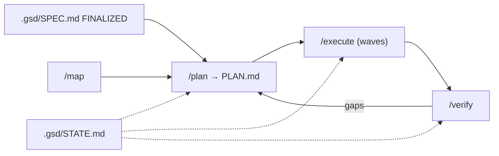

# DunasTech — Harness de Desenvolvimento (GSD + MCP)

> O "harness" é o aparato que conduz o desenvolvimento: a metodologia **GSD** (_Get Shit Done_), suas skills, workflows, estado `.gsd/`, adapters model-agnostic e os servidores **MCP** do projeto.
> Fontes: `PROJECT_RULES.md`, `GSD-STYLE.md`, `.agents/skills/*`, `.agent/workflows/*`, `.gsd/*`, `adapters/*`, `.cursor/mcp.json`.

## 1. Metodologia GSD

**Protocolo canônico:** `SPEC → PLAN → EXECUTE → VERIFY → COMMIT` (`PROJECT_RULES.md`).

| Fase | O que | Onde |
|------|-------|------|
| **SPEC** | Requisitos até `Status: FINALIZED` | `.gsd/SPEC.md` |
| **PLAN** | Fases no roadmap + `PLAN.md` detalhados | `.gsd/ROADMAP.md`, `.gsd/phases/{N}/` |
| **EXECUTE** | Implementação em _waves_, commits atômicos | skill `executor` |
| **VERIFY** | Prova empírica contra must-haves | skill `verifier` |
| **COMMIT** | Uma task = um commit, `type(scope): description` | convenção |

Regras transversais:
- **Planning lock:** nada de código até `.gsd/SPEC.md` estar `FINALIZED`.
- **Waves:** planos agrupados por dependência (`depends_on`) → wave 1 sem deps (paralela), waves seguintes esperam a anterior.
- **Prova obrigatória** por tipo de mudança (API→curl, UI→screenshot, build→output, teste→runner, config→comando). Proibido "parece certo".
- **Orçamento de contexto/token:** _search-first_; arquivos >200 linhas → outline; após 3 falhas de debug → _state dump_ + sessão nova; `STATE.md` = memória entre sessões.
- **Commits:** tipos `feat|fix|docs|refactor|test|chore`; scope = fase (ex.: `feat(phase-1): …`).

## 2. Skills (`.agents/skills/*/SKILL.md`)

| Skill | Propósito | Dispara quando |
|-------|-----------|----------------|
| **codebase-mapper** | Mapeia estrutura/deps/débito → `ARCHITECTURE.md`/`STACK.md` | `/map`; brownfield antes de `/plan` |
| **context-fetch** | Descoberta _search-first_; leituras direcionadas | antes de codar/refatorar/investigar |
| **context-compressor** | Resumo/outline/diff p/ encolher contexto | ao entender arquivos; em 50%/70% de budget |
| **token-budget** | Estima/rastreia uso de tokens | antes/durante tasks |
| **context-health-monitor** | Detecta "context rot" (3 strikes) | 3+ falhas de debug; recomenda `/pause` |
| **planner** | Decompõe fases em `PLAN.md`, waves, must-haves | `/plan` |
| **plan-checker** | Valida PLAN em 6 dimensões antes de executar | após `/plan`, antes de `/execute` |
| **executor** | Executa tasks, deviations, checkpoints, commits, `SUMMARY.md` | `/execute` |
| **empirical-validation** | Exige prova antes de "done" | `/execute`, `/verify` |
| **verifier** | Auditoria de must-have/artefato/wiring → `VERIFICATION.md` | `/verify` |
| **debugger** | Debug por hipótese, `DEBUG.md`, restart 3-strike | `/debug` |

## 3. Workflows / slash-commands (`.agent/workflows/*.md`)

Loop canônico: `/map → /plan → /execute → /verify → (loop se houver gaps)`.

| Comando | Fase | Propósito |
|---------|------|-----------|
| `/new-project` | SPEC | Questionamento profundo → artefatos `.gsd/` |
| `/map` | SPEC (contexto) | Análise brownfield → `ARCHITECTURE.md`/`STACK.md` |
| `/discuss-phase`, `/research-phase`, `/list-phase-assumptions` | PLAN (pré) | Clarificar escopo, pesquisar, expor premissas |
| `/plan` | PLAN | Cria `PLAN.md` (skills planner + plan-checker) |
| `/execute` | EXECUTE | Executa waves (executor + empirical-validation) |
| `/verify` | VERIFY | Auditoria empírica (verifier) |
| `/debug` | Recuperação | Debug sistemático (debugger) |
| `/new-milestone`, `/complete-milestone`, `/audit-milestone`, `/plan-milestone-gaps` | Milestone | Gestão de milestones |
| `/add-phase`, `/insert-phase`, `/remove-phase` | PLAN | Editar roadmap |
| `/progress`, `/pause`, `/resume`, `/add-todo`, `/check-todos`, `/sprint` | Estado | Navegação/estado |
| `/install`, `/update`, `/help`, `/whats-new`, `/web-search` | Meta | Manutenção do harness |

## 4. Estado `.gsd/`

| Arquivo | Papel | Status atual |
|---------|-------|--------------|
| `SPEC.md` | Visão/metas/critérios | **FINALIZED** (DunasTech Next.js/Firebase) |
| `ROADMAP.md` | Fases + progresso | Fase 1, _planning_; 0/9 planos |
| `STATE.md` | Memória de sessão | Fase 0 — planning; pivot p/ Next.js |
| `REQUIREMENTS.md` | Matriz REQ-01–10 | Pendente; alinhado ao Next.js |
| `ARCHITECTURE.md` / `STACK.md` | Saída do `/map` | Ver nota de inconsistência abaixo |
| `DECISIONS.md` / `JOURNAL.md` / `TODO.md` | ADRs / log / captura | Ainda referenciam o MVP Streamlit (pré-pivot) |
| `templates/` (24) | Modelos p/ copiar | válidos (17 warnings de `Last updated`) |
| `examples/` (4) | Referência read-only | cheat sheet + walkthroughs |

> **⚠️ Inconsistência de estado (pivot):** `SPEC`/`ROADMAP`/`REQUIREMENTS` refletem o pivot para Next.js, mas `DECISIONS`/`JOURNAL`/`TODO` (e o antigo `ARCHITECTURE.md`) ainda descrevem o MVP em **Streamlit**. Não existe `.gsd/phases/{N}/` — ou seja, `/plan 1` ainda não foi rodado sobre a nova stack. A **arquitetura real** está documentada em `docs/architecture/` (esta pasta).

## 5. Adapters model-agnostic

Regra absoluta: as regras canônicas vivem só em `PROJECT_RULES.md`; adapters são **opcionais** e não podem duplicar regra nem quebrar se um modelo faltar.

| Adapter | Path | Melhorias opcionais |
|---------|------|---------------------|
| Claude | `adapters/CLAUDE.md` | níveis de thinking, artifacts, parsing XML |
| Gemini | `adapters/GEMINI.md` | Flash vs Pro, contexto grande, grounding |
| GPT/OSS | `adapters/GPT_OSS.md` | function calling, contexto curto, deploy local |

Complementos: `.gemini/GEMINI.md` (integração Antigravity), `model_capabilities.yaml` (registro **opcional** de capacidades — `thinking_mode`, `long_context`, `tools`, `speed_tier` + perfis `fast_coder`/`standard`/`reasoning`), `docs/model-selection-playbook.md`.

## 6. Validadores (`scripts/`)

| Script | Valida |
|--------|--------|
| `validate-workflows.sh`/`.ps1` | frontmatter + `description` dos workflows |
| `validate-skills.sh`/`.ps1` | `name`+`description` das skills |
| `validate-templates.sh`/`.ps1` | título + tamanho dos templates |
| `validate-all.sh`/`.ps1` | agrega tudo |

Rode via `bash scripts/validate-all.sh` (os sub-scripts podem não ter bit de execução). Resultado observado: workflows 27/27, skills 11/11, templates 24/24 (17 warnings).

## 7. Servidores MCP do projeto (`.cursor/mcp.json`)

Declarados no repo e lançados pelo Cursor via `npx` (cross-platform). Nenhum exige secret para **subir**:

| Servidor | Categoria | Pacote | Uso |
|----------|-----------|--------|-----|
| `context7` | Essencial | `@upstash/context7-mcp` | docs atualizadas (Next 16, React 19, Firebase, next-intl, MapLibre) |
| `playwright` | Essencial | `@playwright/mcp` | E2E/automação de browser dos fluxos B2C/B2G |
| `chrome-devtools` | Performance | `chrome-devtools-mcp` | Lighthouse, Core Web Vitals, traces de performance |
| `firebase` | Essencial (domínio) | `firebase-tools experimental:mcp` | Firestore/Auth/Hosting (rodar `firebase_login` antes de operar) |

Notas: os MCPs de browser exigem Chrome/Chromium; remova `--headless` localmente para assistir. `context7` aceita `CONTEXT7_API_KEY` opcional. Todos os 4 foram verificados via handshake `initialize` + `tools/list`.

## 8. Modelo mental

