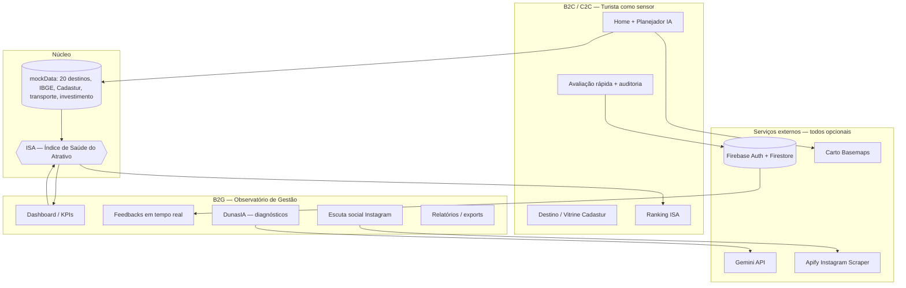

# DunasTech — Arquitetura & Taxonomia

> **Observatório Inteligente do Turismo** do Rio Grande do Norte.
> Documentação viva da ideia, do produto, do código e do harness de desenvolvimento (GSD).

Este diretório mapeia o projeto em quatro camadas complementares. Comece por aqui e navegue conforme a necessidade.

| Documento | O que cobre | Leia quando... |
|-----------|-------------|----------------|
| [`PRODUCT.md`](./PRODUCT.md) | A **ideia e o produto**: visão, atores, proposta de valor, o índice ISA, features B2C/B2G, jornadas e monetização. | Você precisa entender *o que* o DunasTech é e *para quem*. |
| [`TAXONOMY.md`](./TAXONOMY.md) | A **taxonomia do projeto**: glossário de domínio, entidades/modelo de dados, taxonomia de diretórios, rotas e componentes. | Você precisa localizar um conceito, entidade, rota ou componente no código. |
| [`TECH-ARCHITECTURE.md`](./TECH-ARCHITECTURE.md) | A **arquitetura técnica**: stack, roteamento/i18n, árvore de providers, contratos das API routes, persistência com _graceful degradation_, mapas e variáveis de ambiente. | Você vai implementar, integrar ou depurar código. |
| [`HARNESS.md`](./HARNESS.md) | O **harness de desenvolvimento** (metodologia GSD): protocolo SPEC→PLAN→EXECUTE→VERIFY→COMMIT, skills, workflows, estado `.gsd/`, adapters de modelo e servidores MCP. | Você vai conduzir trabalho seguindo o processo do repositório. |

## Visão de sistema (alto nível)



## Mapa mental do repositório

```
DunasTech/
├── src/                     ← O PRODUTO (Next.js 16 app)  → TECH-ARCHITECTURE.md / TAXONOMY.md
│   ├── app/[locale]/        ← rotas B2C + gestão (B2G) + /api
│   ├── components/          ← tourist / admin / ui
│   ├── data/                ← mockData (domínio) + imageMap
│   ├── providers/           ← Theme / Intl / Auth
│   ├── lib/                 ← firebase, utils
│   └── i18n/                ← pt-BR / en / es
│
├── .gsd/ .agent/ .agents/   ← O HARNESS (metodologia GSD)  → HARNESS.md
├── adapters/ .gemini/       ← adapters model-agnostic
├── docs/                    ← documentação operacional + esta pasta
├── scripts/                 ← validadores do harness
└── .cursor/mcp.json         ← servidores MCP do projeto
```

> **Fronteira app × harness:** tudo em `src/` é o app executável (ver `package.json`). `.gsd/`, `.agent/`, `.agents/`, `adapters/`, `docs/`, `scripts/` são a metodologia/tooling GSD e **não** fazem parte do runtime.

---

_Gerado a partir de um mapeamento completo da codebase. Caminhos de arquivo são citados ao longo dos documentos como evidência._
