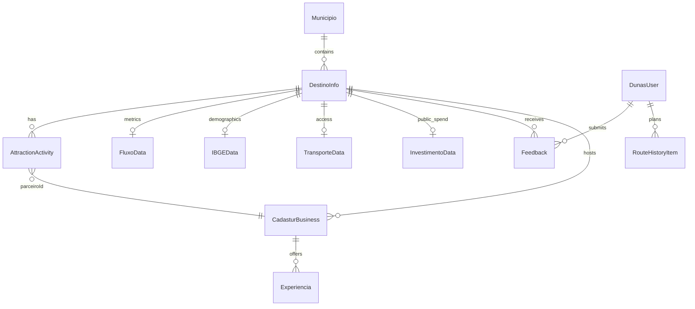

# DunasTech — Taxonomia do Projeto

> Classificação do projeto em três eixos: **domínio** (glossário + entidades), **código** (diretórios, rotas, componentes) e **dados** (chaves de persistência).
> Fontes: `src/data/mockData.ts`, `src/providers/AuthProvider.tsx`, `src/app/[locale]/**`, `src/components/**`.

## 1. Glossário de domínio

| Termo | Significado no DunasTech |
|-------|--------------------------|
| **ISA** | _Índice de Saúde do Atrativo_ — score 0–100 derivado de feedbacks, investimento e saturação (`calcularISA`). Faixas: ≥80 Saudável, ≥60 Atenção, <60 Crítico. |
| **Destino / Atrativo** | Um dos 20 pontos turísticos do RN monitorados (`DestinoInfo`). |
| **Município** | Unidade territorial; **não** é um tipo próprio — é o campo `DestinoInfo.municipio`, agregado em `/gestao/cidades`. |
| **Cadastur** | Cadastro federal de prestadores de serviços turísticos; negócios "regularizados" recebem selo (`CadasturBusiness`). |
| **Vitrine** | Storefront público de um negócio Cadastur (`/vitrine/[id]`). |
| **Feedback / Avaliação** | Contribuição do turista (nota + critérios booleanos + conformidade + comentário) — o "sensor". |
| **Conformidade** | Auditoria "foto vs. realidade" anexada ao comentário do feedback (`[Conformidade: …]`). |
| **Saturação** | Índice de lotação turística (0–100) por destino (`FluxoData.saturacao_turistica`). |
| **Fluxo** | Volume de visitantes/mês e receita estimada (`FluxoData`). |
| **DunasIA** | Assistente/diagnóstico Gemini na gestão (`/gestao/ia`). |
| **Sensor (monitorado)** | Flag por destino indicando se está sob monitoramento ativo (`monitorado`, `dunastech_monitored_spots`). |
| **B2C / C2C** | Superfície do turista (home, destino, avaliar, ranking, perfil, vitrine). |
| **B2G** | Superfície de gestão pública (`/gestao/*`). |

## 2. Entidades / modelo de dados

Fonte primária: `src/data/mockData.ts` (dados estáticos/mock de ~1,2k linhas). Auth: `src/providers/AuthProvider.tsx`.

| Entidade | Campos-chave | Notas |
|----------|--------------|-------|
| **DestinoInfo** | `nome` (id), `municipio`, `descricao`, `imagem`, `latitude`, `longitude`, `hashtag`, `monitorado?`, `atracoes[]` | 20 destinos do RN. |
| **AttractionActivity** | `id`, `nome`, `descricao`, `imagem`, `parceiroId → CadasturBusiness.id` | Atrações aninhadas em um destino. |
| **CadasturBusiness** | `id`, `cnpj`, `nome`, `tipo` (`Hotel\|Restaurante\|Guia\|Pousada\|Agência`), `destino`, `regularizado`, `nota`, `telefone`, `imagem`, `latitude`, `longitude`, `experiencias[]` | ~800 registros (estáticos + gerados). Gestão adiciona em runtime `vencimento`, `statusCadastur` (`active\|expiring\|expired`). |
| **Feedback** | `id?`, `destino`, `nota_geral` (1–5), 8 booleanos (`limpo`, `sinalizado`, `preservado`, `acessibilidade`, `seguranca`, `custo_beneficio`, `conservacao`, `superlotado`), `comentario?`, `timestamp` | Núcleo do "sensor". `avaliacaoOptions` define os pesos p/ o ISA. |
| **FluxoData** | `destino`, `fluxo_visitantes_mes`, `receita_estimada_milhoes`, `saturacao_turistica`, `hashtag_instagram` | Métricas por destino. |
| **IBGEData** | `populacao`, `area_km2`, `idh`, `leitos_hospitalares`, `escolas_publicas` | Demografia por destino/município. |
| **TransporteData** | `voos_mensais`, `onibus_mensais`, `veiculos_terrestres_mensais`, `modal_principal`, `variacao_percentual` | Acessibilidade/mobilidade. |
| **InvestimentoData** | `investimento_infraestrutura_mil`, `investimento_saneamento_mil`, `investimento_turismo_mil`, `total_mil`, `ano` | Investimento público (2026). |
| **DunasUser** | `uid`, `email`, `displayName`, `photoURL`, `cpf`, `role` (`tourist\|admin`), `provider` (`google\|cpf\|mock`), `createdAt` | `AuthProvider.tsx`. |
| **RouteHistoryItem** | `id`, `title`, `style`, `duration`, `transport`, `date`, `destinations[]` | Client-only (`localStorage`), gerado pelo planejador. |
| **InstagramPost / InstagramResult** | Post: `ownerUsername`, `caption`, `likesCount`, `commentsCount`, `sentiment`. Result: `hashtag`, `posts[]`, totais, `cachedAt` | Retorno da `/api/scraper`. |
| **MunicipioStats** | agregados de IBGE + fluxo + investimentos por `municipio` | Computado em `/gestao/cidades`, não persistido. |
| **ISA / Ranking** | — | **Derivado** via `calcularISA()`, não é entidade armazenada. |

## 3. Taxonomia de diretórios (o app, `src/`)

| Diretório | Papel | Conteúdo |
|-----------|-------|----------|
| `src/app/[locale]/` | Rotas | Páginas B2C + `gestao/` (B2G). Locale por cookie, sem prefixo na URL. |
| `src/app/api/` | Backend | `gemini/route.ts`, `scraper/route.ts`. |
| `src/components/tourist/` | UI B2C | `TouristHomePage`, `TouristLayout`, `DestinationDetailPage`, `RankingPage`, `EvaluationPage`, mapas MapLibre (`HomeRouteMap`, `DestinationMap`). |
| `src/components/admin/` | UI B2G | `AdminLayout`, `AdminDashboardPage`, `DestinosMap` (Leaflet), KPIs/charts. |
| `src/components/ui/` | Design system | `Card`, `Badge`, `Button`, `Input`, `StarRating`, `ProgressBar`, `LanguageSelector`, `LocalImage`, etc. |
| `src/data/` | Domínio | `mockData.ts` (entidades + `calcularISA`), `imageMap.ts`. |
| `src/providers/` | Contexto | `ThemeProvider`, `IntlProvider`, `AuthProvider`. |
| `src/lib/` | Utilitários | `firebase.ts` (persistência + fallback), `utils.ts` (`cn`, `validateCPF`, `slugify`, formatadores). |
| `src/i18n/` | i18n | `config.ts` + `messages/{pt-BR,en,es}.json`. |
| `src/legacy/` | Legado | Excluído do build (`tsconfig.json`). |

## 4. Taxonomia de rotas → componentes → entidades

### B2C
| Rota | Componente | Entidades tocadas |
|------|-----------|-------------------|
| `/` | `TouristHomePage` + `HomeRouteMap` | DestinoInfo, CadasturBusiness, FluxoData, ISA, RouteHistoryItem |
| `/destino/[id]` | `DestinationDetailPage` + `DestinationMap` | DestinoInfo, AttractionActivity, CadasturBusiness, FluxoData, Feedback |
| `/ranking` | `RankingPage` | DestinoInfo, Feedback, ISA |
| `/avaliar` | `EvaluationPage` | Feedback, DunasUser |
| `/vitrine/[id]` | `vitrine/[id]/page` | CadasturBusiness, Experiencia |
| `/perfil` | `perfil/page` | DunasUser, RouteHistoryItem |
| `/login` | `login/page` | DunasUser |
| `/pitch` | `pitch/page` | (dados agregados p/ apresentação) |

### B2G (`/gestao`)
| Rota | Componente | Entidades tocadas |
|------|-----------|-------------------|
| `/gestao` | `AdminDashboardPage` | Feedback, FluxoData, TransporteData, ISA |
| `/gestao/destinos` | `gestao/destinos/page` + `DestinosMap` | DestinoInfo, FluxoData, IBGEData, TransporteData, ISA |
| `/gestao/cidades` | `gestao/cidades/page` | MunicipioStats (IBGE + fluxo + investimento) |
| `/gestao/cadastur` | `gestao/cadastur/page` | CadasturBusiness (+ status de vencimento) |
| `/gestao/feedbacks` | `gestao/feedbacks/page` | Feedback (tempo real) |
| `/gestao/social` | `gestao/social/page` | InstagramResult/Post, FluxoData |
| `/gestao/ia` | `gestao/ia/page` | Feedback, ISA, TransporteData, InvestimentoData |
| `/gestao/relatorios` | `gestao/relatorios/page` | Feedback (export) |

## 5. Taxonomia de i18n

| Item | Valor |
|------|-------|
| Locales | `pt-BR` (default), `en`, `es` — `src/i18n/config.ts` |
| Resolução | cookie `NEXT_LOCALE`, fallback `pt-BR` |
| Prefixo de URL | `localePrefix: 'never'` (URLs limpas) |
| Fuso | `America/Fortaleza` |
| Namespaces | `common`, `nav`, `auth`, `tourist`, `evaluation`, `ranking`, `admin`, `theme`, `footer`, `planner` (o maior) |

> **Cobertura parcial:** `useTranslations` é usado principalmente em `TouristLayout`/`TouristHomePage`; boa parte da gestão e da `EvaluationPage` tem português _hardcoded_ apesar dos namespaces existirem. A página `/pitch` usa um dicionário inline próprio.

## 6. Taxonomia de persistência (chaves de estado)

| Chave `localStorage` | Uso |
|----------------------|-----|
| `dunastech_mock_user` | Sessão de auth mock (sem Firebase). |
| `dunastech_feedbacks` | Feedbacks (fallback sem Firestore). |
| `dunastech_apify_token` | Token Apify fornecido pelo cliente. |
| `dunastech_monitored_spots` | Seleção de destinos monitorados (gestão). |
| `dunastech-theme` | Tema (via next-themes). |
| `dunastech_route_history` | Histórico de roteiros do perfil. |

Coleções Firestore (quando configurado): `feedbacks`, `users`.
