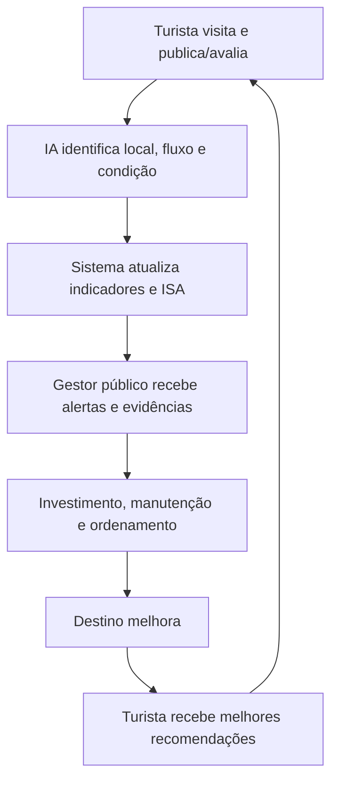

# 00 — Visão Geral: A Ideia Polida

> Objetivo deste documento: deixar a ideia da DunasTech **madura, clara e apresentável** — pronta para pitch ao governo e para escalar.

---

## 1. One-liner (pitch de uma frase)

> **DunasTech é a plataforma de inteligência de dados do turismo do RN que transforma cada turista em um sensor do território — gerando, ao mesmo tempo, uma experiência melhor para quem visita e evidências para quem decide (governo, prefeituras e empresas).**

## 2. Elevator pitch (30 segundos)

O turismo é a espinha dorsal da economia do Rio Grande do Norte (76% do PIB estadual), mas os dados que sustentam decisões são **fragmentados, lentos e presos em silos**. A DunasTech agrega dados oficiais (Cadastur, SÍRIO, IBGE, Emprotur), dados da web (Google, Instagram, Booking) e a **participação cidadã do turista** em uma única plataforma. Para o turista, entregamos um **guia inteligente** e uma **avaliação rápida**. Para o gestor público e o empresário, entregamos **painéis preditivos, alertas e o ISA** — o Índice de Saúde do Atrativo Turístico. É a evolução do turismo baseado em intuição para o turismo baseado em evidência.

## 3. Problema

- **Assimetria de informação:** grandes players dominam a comercialização; pequenos prestadores e destinos do interior (Seridó, Serras de Martins, Lajedo de Soledade) lutam por visibilidade.
- **Gestão pública sem visibilidade:** o estado carece de dados consolidados e em tempo real para priorizar investimento, manutenção e marketing.
- **Turista sobrecarregado de informação fragmentada:** horas cruzando buscas, risco de contratar prestadores clandestinos, recomendações genéricas.
- **Degradação silenciosa dos atrativos:** alto fluxo sem investimento proporcional gera risco ambiental e de imagem sem que ninguém "meça" a tempo.

## 4. Solução

Plataforma de inteligência turística com **ciclo de dados circular**:

**Três frentes de valor:**

- **B2C/C2C — Guia + Sensor:** descoberta por perfil (praias, gastronomia, natureza, cultura, vida noturna, sustentável) e **avaliação inteligente por checkboxes** (limpo, seguro, acessível, precisa manutenção...), que gera dados objetivos sem depender de texto livre.
- **B2G — Observatório de Gestão:** fluxo turístico, investimentos, estado de conservação, ranking de atrativos, pressão turística, alertas automáticos e **insights gerados por IA**.
- **B2B — Inteligência de Mercado:** mapas de intenção e tendências para hotéis, agências e investidores decidirem onde/quando investir.

## 5. O diferencial: o ISA (Índice de Saúde do Atrativo Turístico)

Nosso ativo-âncora. Cruza **fluxo de visitantes + investimento público/privado + estado de conservação + percepção dos turistas** em uma **nota de 0 a 100** por atrativo (quanto menor, maior a necessidade de intervenção). Alinhado à lógica de indicadores de sustentabilidade do **Plano Nacional de Turismo 2024–2027**.

> Em vez de apenas mostrar **onde** o turista está, a DunasTech mostra **como o destino está sendo cuidado.** Esse é o diferencial frente a um dashboard tradicional.

Exemplo de insight automático:
> "A Praia X recebeu aumento de 42% no fluxo turístico, porém os investimentos em infraestrutura permaneceram estáveis. Recomenda-se priorizar manutenção, limpeza e ordenamento."

## 6. Posicionamento

**Smart Tourism Assistant & Market Intelligence Hub** para o RN — não um "diretório de viagens", mas a **camada de inteligência** que conecta turista, poder público e trade.

- **Instrumento de política pública sustentável:** ao recomendar destinos periféricos (Programa DEL Turismo: Tibau do Sul, São Miguel do Gostoso, Apodi), alivia a pressão sobre a capital e distribui renda para o interior.
- **Autoridade e conformidade:** só recomenda prestadores regularizados no Cadastur.

## 7. Marca e nomenclatura

Nome de trabalho: **DunasTech**. Para a marca institucional voltada ao governo, avaliamos posicionar o produto como **"Observatório Inteligente do Turismo do RN"**. Opções de sigla estudadas:

- **OIT-RN** — Observatório de Inteligência Turística do RN (institucional; atenção à colisão com a sigla da OIT).
- **OPIT** — Observatório Potiguar de Inteligência Turística (curto e forte).
- **ODIT** — Observatório de Dados e Inteligência Turística (destaca dados).
- **OTI-RN** — Observatório de Turismo Inteligente do RN (memorável).

**Recomendação:** manter **DunasTech** como marca-empresa (startup/produto) e usar **"Observatório Inteligente do Turismo do RN"** como marca-institucional/governamental do painel B2G. Decisão final de marca fica com Claudia + Leonardo (ver cronograma, marco de 22/07).

## 8. Visão de futuro (para onde escala)

- Fase 1 (agora): RN, foco no ISA e no B2G para a Secretaria de Turismo.
- Fase 2: expansão para prefeituras e trade (B2B) do RN.
- Fase 3: replicação do modelo para outros estados do Nordeste (produto white-label de observatório de turismo).

## 9. O que NÃO somos

- Não somos uma OTA (agência de viagens online) nem concorremos com Booking/Decolar.
- Não vendemos pacotes; vendemos **inteligência e evidência**.
- Não dependemos de um único cliente: o dado do B2C sustenta o B2G/B2B.
