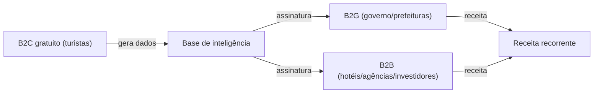

# 01 — Relatório Estratégico Completo

> Documento de referência para tomada de decisão. Consolida **situação atual**, **gestão estratégica**, **cenário e oportunidades** e o **modelo de negócio** da DunasTech.

---

## PARTE A — Situação Atual

### A.1. Onde estamos (snapshot)

| Dimensão | Status | Observação |
|----------|--------|------------|
| Produto (MVP) | 🟢 Funcional | App web Next.js com B2C, B2G, ISA e APIs (Gemini/Apify). Ver [`.gsd/SPEC.md`](../../.gsd/SPEC.md). |
| Qualidade técnica | 🟡 A endereçar | Auditoria acusou 82 issues de lint (14 erros, 68 avisos); segurança OK. |
| Pesquisa de mercado | 🟢 Consolidada | Dados macro do RN, personas, fontes e polos mapeados. |
| Tração institucional | 🟡 Em construção | Vitória em hackathon + reuniões relevantes; alvo é a reunião de 30/07. |
| Equipe | 🟡 Em formação | 5 pessoas, papéis a formalizar; engajamento e ramp-up em curso. |
| Sociedade/jurídico | 🔴 Pendente | Equity definido (Cenário B); falta formalizar acordo de sócios e CNPJ. |

### A.2. Situação do produto

O MVP (Observatório Inteligente do Turismo) já cobre os fluxos principais auditados como funcionais: homepage do turista, formulário de avaliação, ranking, detalhamento de destino, painel de gestão (com ISA interativo), gestão de municípios e monitoramento Cadastur. O *social listening* funciona em modo simulado (requer token para busca real). Arquitetura resiliente: Firebase com fallback para `localStorage` e *polling* de 2s, o que dá robustez para demos mesmo sem internet estável.

**Dívida técnica prioritária (do audit):** erros de `set-state-in-effect` em mapas/views, tipagens implícitas `any`, uso de `` em vez de `next/image`. Não bloqueiam a demo, mas devem ser saneados antes de escalar (backlog do Antônio).

### A.3. Situação da equipe (honesta)

Pontos fortes: núcleo motivado, produto pronto, mercado quente. Riscos reais observados nas reuniões: **pontualidade e engajamento irregulares**, **lacuna de conhecimento técnico** sobre arquitetura/APIs, e dependência excessiva do fundador. Contramedidas já decididas: regras de conduta, dedicação mínima de 2h/dia, ramp-up para todos com proatividade, e cadência de reuniões com atas. Detalhes em [`03-EQUIPE-E-GOVERNANCA.md`](03-EQUIPE-E-GOVERNANCA.md).

---

## PARTE B — Gestão Estratégica

### B.1. Missão, Visão, Valores

- **Missão:** transformar dados do turismo do RN em decisões melhores para governo, empresas e turistas.
- **Visão:** ser o observatório de inteligência turística de referência do Nordeste até 2028.
- **Valores:** evidência acima de intuição; entrega acima de intenção; proatividade; sustentabilidade do destino; transparência.

### B.2. OKRs do trimestre (Jul–Set/2026)

**Objetivo 1 — Chegar forte na reunião do governo (30/07).**
- KR1: Pitch deck + one-pager + demo do ISA prontos e ensaiados até 29/07.
- KR2: 1 documento de proposta de valor B2G entregue à Secretaria.
- KR3: 100% dos papéis e sociedade formalizados até 13/07.

**Objetivo 2 — Consolidar produto e dados.**
- KR1: Zerar erros críticos de lint/build do MVP.
- KR2: Validar e documentar 3 fontes de dados oficiais (Cadastur, SÍRIO, IBGE).
- KR3: ISA calculado com dados reais em ao menos 5 atrativos.

**Objetivo 3 — Estruturar a operação.**
- KR1: Jira com épicos, board e 2 sprints planejadas.
- KR2: Cadência de dailies + reviews rodando com atas.
- KR3: Cada membro com trilha de ramp-up iniciada e evidência de progresso.

### B.3. SWOT

**Forças:** produto funcional e diferenciado (ISA); domínio do negócio local; vitória de hackathon; custo de operação baixo; fundador com experiência em produto/IA.

**Fraquezas:** equipe júnior com lacunas técnicas; dependência do fundador; sem CNPJ/contratos ainda; dívida técnica no MVP; monetização não validada.

**Oportunidades:** boom do turismo no RN (+151% internacionais); governo carente de dados; descentralização como política pública; leis de incentivo/FUNGETUR; academia forte (UFRN/UERN) para parceria e credibilidade; secretaria enxuta (4 funcionários, sem turismólogo) = dor real.

**Ameaças:** ciclo político/orçamento público lento; concorrência de consultorias/BI tradicionais; dependência de fontes de dados de terceiros (mudança de API/scraping); risco de churn de membros.

### B.4. Riscos e mitigação

| Risco | Prob. | Impacto | Mitigação |
|-------|-------|---------|-----------|
| Membro-chave sai | Média | Alto | Vesting com cliff; documentação; papéis com backup |
| Reunião do governo não converte | Média | Alto | One-pager de valor + prova (ISA real) + follow-up estruturado |
| Fonte de dados quebra | Média | Médio | Múltiplas fontes; camada ETL desacoplada; cache |
| Dívida técnica trava demo | Baixa | Alto | Fallback local; saneamento prévio de erros críticos |
| Dependência do fundador | Alta | Médio | Ramp-up de todos; proatividade; delegação por RACI |

---

## PARTE C — Cenário e Oportunidades (conhecimento profundo)

### C.1. Peso macroeconômico do turismo no RN

- **76% do PIB** estadual vem de comércio, serviços e turismo.
- **75% do ICMS** arrecadado vem desse aglomerado setorial.
- **73% dos empregos** formais no setor terciário; +27 mil carteiras ligadas diretamente ao turismo (início de 2023).
- **Alta estação (dez–fev):** injeta ~**R$ 1,7 bilhão** na economia local.

### C.2. Explosão da demanda internacional

- **Jan–Mai/2026:** 34.815 turistas internacionais — já superando todo o ano de 2025 (32.393).
- **+151%** vs. período homólogo — **maior crescimento do Brasil**.

### C.3. Perfil e comportamento do turista

- **89,4%** viajam por lazer/descanso; **34,2%** em família, **29%** casais sem filhos.
- **Permanência média:** regional 3,8 dias · nacional 6,1 dias · internacional 8,3–9 dias.
- **Gasto médio diário:** entre **R$ 296 e R$ 428** (maiores tickets: Centro-Oeste e Sudeste). Componentes típicos: hospedagem R$185,50 · alimentação R$120,20 · passeios R$95,80 · transporte R$45,40 · compras R$38,60 (base Fecomércio).
- **Fidelização:** ~**91%** pretendem voltar; **>51%** estão na 1ª visita → produto precisa de **descoberta** (estreantes) e **aprofundamento/fidelização** (retornados).

### C.4. Regionalização (polos turísticos)

| Polo | Municípios-chave | Vocação | Desafio |
|------|------------------|---------|---------|
| Costa das Dunas | Natal, Parnamirim, Tibau do Sul (Pipa), Extremoz, Touros | Sol e mar, resorts, vida noturna, buggy (Genipabu) | Superlotação, pressão ambiental |
| Costa Branca | Mossoró, Areia Branca, Macau, Guamaré | Histórico, dunas, Mossoró Cidade Junina, sal | Captação de investimento privado |
| Seridó | Caicó, Currais Novos, Acari | Rural, religioso, Geoparque Seridó, gastronomia | Acessibilidade e promoção |
| Serrano | Portalegre, Martins | Clima de montanha, ecoturismo | Sazonalidade, rede hoteleira |
| Agreste/Trairi | Monte das Gameleiras, Passa e Fica | Aventura, trilhas, rural | Formalização de prestadores |

> **Oportunidade estratégica:** o fluxo se concentra em Natal/Tibau do Sul. A descentralização é prioridade de governo — e nosso algoritmo de recomendação sustentável é o veículo ideal. Destinos do Programa DEL Turismo (Tibau do Sul, São Miguel do Gostoso, Apodi) já estão no ranking Sustainable Top 100 Destinations.

### C.5. Personas (o que cada uma quer responder)

- **Governo Estadual:** quais regiões crescem? onde investir? quais cidades precisam de apoio? qual evento gera retorno?
- **Prefeitura:** quantos turistas recebi? quanto movimentaram? quais hotéis estão cheios? quais eventos funcionam?
- **Empresário:** quando contratar? quando investir? qual público atendo? quanto cobrar?
- **Investidor:** onde abrir hotel/restaurante? quais praias crescem? onde há demanda?
- **Turista:** eventos, praias, atrações, roteiros, hospedagens.

### C.6. Fontes de dados (nosso motor)

**Estruturadas (oficiais, dão autoridade):** Cadastur (MTur, via CKAN/CSV) · SÍRIO (Fecomércio/Senac/Emprotur, via relatórios/scraping) · IBGE (população, PIB, hospedagem) · Portal de Dados Abertos RN (SETUR) · Transparência Emprotur · Observatório OPOTUR (UERN/IFRN).

**Não estruturadas (velocidade e sentimento, via Apify):** Google Maps Scraper (POIs, avaliações, GPS) · Instagram Scraper (tendências, sentimento, hashtags) · Website Content Crawler (blogs/notícias → embeddings) · Company Intelligence (enriquecimento B2B).

### C.7. Stakeholders e governança do ecossistema

Sociedade civil organizada, iniciativa privada e poder público; **SEBRAE Turismo**; secretaria estadual **enxuta (4 funcionários, sem turismólogo)** — dor clara que endereçamos; **UFRN** (referência acadêmica, doutorado único do Brasil na área) para parceria/credibilidade.

---

## PARTE D — Modelo de Negócio e Monetização

### D.1. Lógica central: economia de dados circular

O **B2C é gratuito** (maximiza volume de dados e sensores). Esses dados, anonimizados e agregados, **sustentam a venda B2G/B2B**. Quanto mais turistas usam, mais valioso fica o painel para gestores e empresas — efeito de rede.

### D.2. Fontes de receita

- **SaaS B2G (âncora):** assinatura por secretaria/prefeitura para o Observatório + ISA + alertas + relatórios.
- **SaaS B2B:** assinatura para trade turístico (inteligência de mercado, mapas de intenção).
- **Freemium/Ads B2C:** camada gratuita + destaques/parcerias com prestadores regularizados.
- **Serviços/relatórios sob demanda:** estudos customizados e exportações (PDF/XLS).

### D.3. Planos (Bronze / Prata / Ouro)

| Recurso | Bronze | Prata | Ouro |
|---------|:------:|:-----:|:----:|
| Painel de indicadores | ✔ | ✔ | ✔ |
| ISA por atrativo | Limitado | ✔ | ✔ |
| Alertas automáticos | — | ✔ | ✔ |
| Exportação PDF/XLS | — | ✔ | ✔ |
| Social listening / IA preditiva | — | Parcial | ✔ |
| Relatórios customizados | — | — | ✔ |
| Suporte/consultoria | E-mail | Prioritário | Dedicado |

> Preços a definir após validação com a Secretaria (marco 30/07) e primeiros diálogos B2B. Recomenda-se começar com um **piloto** com o governo (prova de valor) antes de fixar tabela.

### D.4. Go-to-market inicial

1. **Governo primeiro (30/07):** conquistar um piloto/carta de intenção com a Secretaria de Turismo — credibilidade e caso de referência.
2. **Prefeituras e polos:** replicar com dados do piloto.
3. **Trade (B2B):** usar tração pública como prova social para hotéis/agências.
4. **Escala regional:** empacotar como produto white-label para outros estados.

### D.5. Métricas que vamos acompanhar

- Produto: nº de avaliações/mês, atrativos monitorados, cobertura de dados.
- Comercial: reuniões → pilotos → contratos; MRR; ticket médio.
- Impacto (venda ao governo): atrativos com ISA melhorando; alertas acionados; decisões apoiadas por dados.
