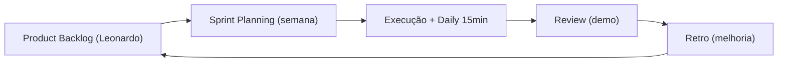
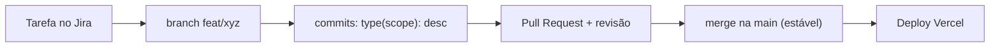
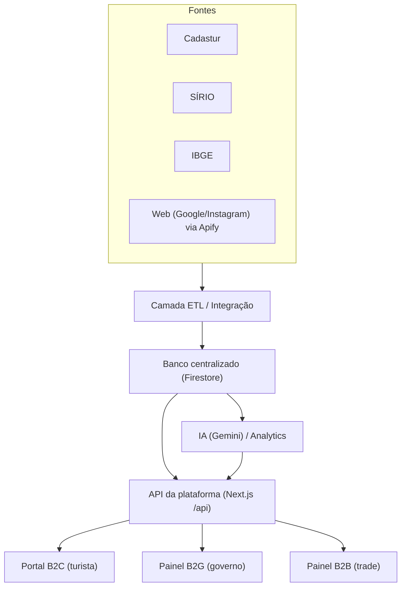

# 04 — Metodologia e Ferramentas

> Como trabalhamos: **Scrum ágil** para ritmo, **Design Thinking** para descobrir o problema certo, **Jira** para organizar, **Git** para versionar e uma **arquitetura de backend** clara para escalar.

---

## 1. Scrum ágil (adaptado ao nosso momento)

Estamos em fase de tração com prazo curto (30/07). Usamos um Scrum **leve**:

- **Sprints de 1 semana** (ciclos curtos para aprender rápido).
- **Papéis:**
  - Product Owner: **Leonardo** (prioriza o backlog, define o "porquê").
  - Facilitadora (Scrum): **Camilly** (protege o processo, organiza cerimônias e board).
  - Time de desenvolvimento: **todos** conforme sua frente.
- **Cerimônias:**
  - **Planning** (início da semana): o que entra na sprint.
  - **Daily** (15 min, todo dia útil): fiz / farei / impedimentos.
  - **Review** (fim da semana): demonstrar o que ficou pronto.
  - **Retro** (fim da semana): o que melhorar no processo.
- **Definição de Pronto (DoD):** entregue + verificado com evidência (build/print/teste/link) + documentado. Alinhado ao princípio do repositório: nunca aceitar "deve funcionar" ([`PROJECT_RULES.md`](../../PROJECT_RULES.md)).

---

## 2. Design Thinking (para o produto e o pitch)

Usamos as 5 fases para garantir que resolvemos a dor real do cliente (governo/turista):

1. **Empatia:** entrevistar/observar personas (Secretaria enxuta sem turismólogo; turista sobrecarregado).
2. **Definição:** declarar o problema ("o gestor não tem evidência para priorizar investimento em atrativos").
3. **Ideação:** gerar soluções (ISA, alertas, mapas de intenção).
4. **Protótipo:** o MVP atual + telas do pitch.
5. **Teste:** validar com o governo (30/07) e iterar.

Ferramentas de apoio: mapa de empatia, jornada do usuário, matriz de priorização (impacto x esforço).

---

## 3. Jira (setup inicial)

**Estrutura sugerida:**
- **Projeto:** DunasTech.
- **Épicos** (grandes blocos):
  1. Fundação & Sociedade
  2. Produto & MVP (saneamento técnico + ISA real)
  3. Dados & Integrações (Cadastur, SÍRIO, IBGE, Apify)
  4. Go-to-Market & Institucional (pitch 30/07)
  5. Marca & Comunicação
- **Tipos de item:** Épico → História/Tarefa → Subtarefa.
- **Board Kanban/Scrum:** colunas `Backlog → A fazer → Em progresso → Em revisão → Concluído`.
- **Campos mínimos:** responsável, estimativa, sprint, definição de pronto.
- **Onboarding:** todos entram no Jira no kickoff (11/07) e estudam tutoriais (dever de casa já acordado nas reuniões).

**Boas práticas:**
- Cada tarefa tem **um responsável** e critério de aceite.
- Nada "em progresso" sem estar no board.
- Camilly mantém o board limpo e as atas linkadas às tarefas.

---

## 4. Git e versionamento

**Fonte da verdade:** repositório `dunastech` (GitHub). Antônio é o responsável (com apoio do founder).

**Fluxo (GitHub Flow simplificado):**
- `main` sempre estável/deployável.
- Branch por tarefa: `feat/...`, `fix/...`, `docs/...`, `chore/...`.
- **Pull Request** obrigatório para entrar na `main` (revisão de ao menos 1 pessoa).
- **Convenção de commits** (do [`PROJECT_RULES.md`](../../PROJECT_RULES.md)): `type(scope): descrição` — `feat`, `fix`, `docs`, `refactor`, `test`, `chore`.
- Um tarefa = um commit lógico; verificar antes de commitar.

---

## 5. Arquitetura online do backend (visão)

Baseada no que já existe (Next.js) e no que precisamos escalar:

**Princípios:**
- **Segredos no servidor:** chaves (Gemini/Apify) só em API Routes; nunca no cliente (já validado na auditoria).
- **Camada ETL desacoplada:** trocar/consertar uma fonte não quebra o resto.
- **Resiliência:** fallback local para demos (já implementado).
- **Documentar a arquitetura** (Antônio) em [`.gsd/ARCHITECTURE.md`](../../.gsd/ARCHITECTURE.md).

**Prioridades técnicas imediatas (do audit):** zerar erros críticos de lint/build, corrigir tipagens `any`, migrar `` → `next/image` onde fizer sentido.

---

## 6. Stack e ferramentas (resumo)

| Categoria | Ferramenta |
|-----------|-----------|
| Gestão ágil | Jira |
| Versionamento | Git / GitHub |
| Frontend/Backend | Next.js (App Router), TypeScript, Tailwind |
| Dados/Realtime | Firebase (Firestore) + fallback local |
| IA | Gemini API |
| Scraping/Web data | Apify (Google Maps, Instagram, Crawler) |
| Deploy | Vercel |
| Comunicação | WhatsApp (grupo), Google Calendar |
| Documentação | Markdown no repositório (`docs/`, `.gsd/`) |
