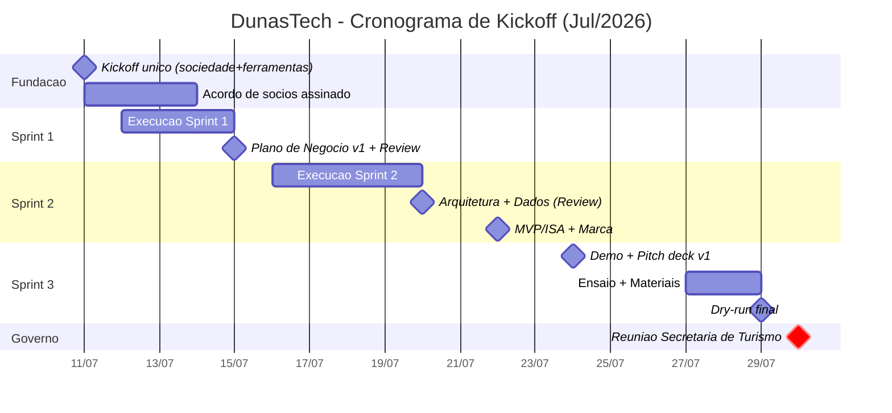

# 05 — Cronograma de Kickoff (11/07 → 30/07)

> Cronograma **consolidado e enxuto**. Prazos curtos exigem foco. Base: **2h/dia** mínimas por integrante (mais nos marcos), **daily de 15 min** todo dia útil e **sprints semanais**. Dias 11 e 13 foram aglutinados em um **kickoff único intensivo (11/07)**.

*Referência de dias da semana (Julho/2026): 11/07 = sábado · 30/07 = quinta-feira.*

---

## 1. Marcos (visão macro)

| Data | Dia | Marco | Entrega-chave | Responsável principal |
|------|-----|-------|---------------|-----------------------|
| **11/07** | Sáb | **KICKOFF único (14h)** | Sociedade acordada, papéis, ferramentas, backlog inicial | Leonardo |
| 15/07 | Qua | **Plano de Negócio v1 + Sprint 1 Review** | Documento v1 + personas validadas | Leonardo / Camilly |
| 20/07 | Seg | **Arquitetura + Dados (Sprint 2 Review)** | Backend/git definidos; fontes validadas | Antônio |
| 22/07 | Qua | **MVP/ISA + Marca** | ISA com dado real + identidade visual | Antônio / Claudia |
| 24/07 | Sex | **Demo interna + Pitch deck v1** | Demo funcional + deck | Leonardo / Ari |
| 27/07 | Seg | **Ensaio + Materiais institucionais** | Deck final, one-pager, doc de decisão | Claudia / Leonardo |
| 29/07 | Qua | **Dry-run final** | Ensaio geral + Q&A do governo | Todos |
| **30/07** | Qui | **REUNIÃO COM O GOVERNO** | Pitch à Secretaria de Turismo | Leonardo |

---

## 2. Detalhamento por período

### 11/07 (Sáb) — KICKOFF ÚNICO (bloco intensivo, 14h)
Aglutina o que seriam os dias 11 e 13.
- **Fundação & Sociedade:** apresentar e acordar o Cenário B (72% / 4% reserva / 6% cada) + vesting; definir cliff (6 ou 12 meses). Ver [`02-FUNDACAO-E-SOCIEDADE.md`](02-FUNDACAO-E-SOCIEDADE.md).
- **Papéis & regras:** confirmar RACI e dedicação de 2h/dia. Ver [`03-EQUIPE-E-GOVERNANCA.md`](03-EQUIPE-E-GOVERNANCA.md).
- **Ferramentas:** todos no Jira e no grupo; criar board e épicos; acessos ao repositório (Git). Ver [`04-METODOLOGIA-E-FERRAMENTAS.md`](04-METODOLOGIA-E-FERRAMENTAS.md).
- **Design Thinking inicial:** definir o problema + personas prioritárias.
- **Sprint 1 Planning:** montar backlog inicial e distribuir tarefas.
- **Saída:** ata com decisões, sociedade acordada, board populado.

### 12–14/07 — Execução Sprint 1 (+ daily 15 min)
- Leonardo: rascunho do Plano de Negócio + backlog.
- Antônio: organizar repositório, branching, começar desenho da arquitetura de backend.
- Camilly: estruturar Jira/atas + documentação.
- Ari: mapear leads/parceiros e roteiro de abordagem.
- Claudia: iniciar identidade visual/marca e presença institucional.

### 15/07 (Qua) — Marco: Plano de Negócio v1 + Sprint 1 Review/Retro
- Consolidar Plano de Negócio v1 (proposta de valor, personas, modelo).
- Review das entregas + retro de processo.

### 16–19/07 — Execução Sprint 2 (+ daily)
- Antônio: arquitetura de backend definida + git workflow rodando.
- Time: validar fontes de dados (Cadastur, SÍRIO, IBGE) e documentar.
- Claudia: avançar identidade visual.

### 20/07 (Seg) — Marco: Sprint 2 Review
- Arquitetura + git workflow **aprovados**; fontes de dados validadas e documentadas.

### 22/07 (Qua) — Marco: MVP/ISA + Marca
- ISA calculado com **dado real** em ao menos alguns atrativos.
- Identidade visual/marca consolidada (decisão de marca institucional).
- Plano de Negócio v2.

### 24/07 (Sex) — Marco: Demo interna + Pitch deck v1 (Sprint 3 Review)
- Demo funcional ponta a ponta.
- Primeira versão do pitch deck para o governo.

### 27/07 (Seg) — Ensaio + Materiais institucionais
- Deck final, one-pager de valor B2G, documento de proposta/decisão para a Secretaria.

### 29/07 (Qua) — Dry-run final
- Ensaio geral cronometrado; simular perguntas do governo; ajustes finais.

### 30/07 (Qui) — REUNIÃO COM O GOVERNO
- Pitch à Secretaria de Turismo. Objetivo: **piloto/carta de intenção**.
- Pós-reunião: registrar follow-ups e próximos passos.

---

## 3. Gantt (Mermaid)

---

## 4. Ritmo e disciplina

- **Daily 15 min** todo dia útil (fiz / farei / impedimentos).
- **2h/dia** mínimas de dedicação por pessoa (mais nos marcos).
- Toda tarefa vive no **Jira**; toda decisão vira **ata** (Camilly).
- Marco não entregue = replanejamento imediato na daily seguinte (não empurrar para o fim).
